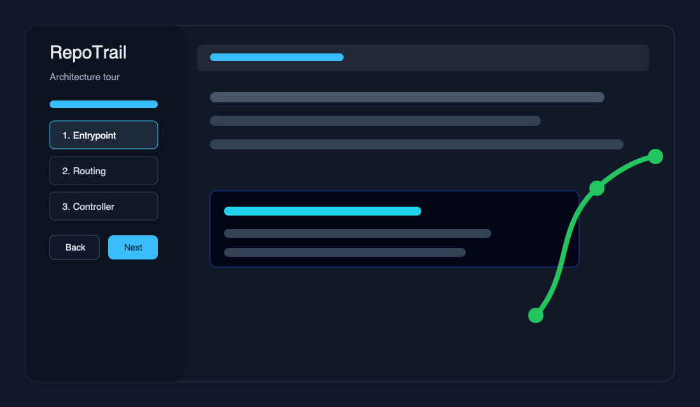
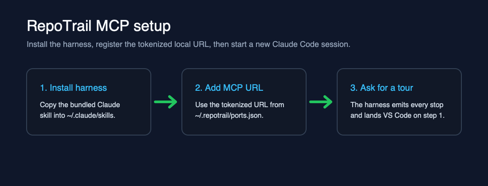

# RepoTrail

**Agent-guided codebase tours inside VS Code.**

RepoTrail turns a repo walkthrough into an editor-native route: your Claude Code
harness chooses the stops, RepoTrail opens the files, highlights tight ranges,
shows narration, and lets you move through the route with Back/Next, CodeLens,
and the sidebar.



## How It Works

RepoTrail has one supported generation path:

1. The VS Code extension runs a local MCP server on `127.0.0.1`.
2. The bundled Claude Code harness connects to that MCP server.
3. The harness reads your repo, emits a complete tour up front, and lands the
   editor on stop 1.
4. You navigate locally in VS Code. Follow-ups and "go deeper" prompts return
   to the harness, which can insert or update tour steps.

The extension does not ship a built-in LLM provider and does not send source
code to a hosted service by itself.

## Install The Claude Code Harness

After installing the extension, open the target workspace in VS Code and run:

```text
RepoTrail: Show MCP Setup
```

Use the command buttons to copy:

1. The harness install command.
2. The `claude mcp add --scope user --transport http repotrail ...` command.

Then start a new Claude Code session in the same repo and ask:

```text
Give me a RepoTrail tour of this repository.
```



## Features

- Full-route tours for architecture, PR/diff walkthroughs, file walkthroughs,
  request lifecycle traces, and bug investigation paths.
- Tight highlighted ranges with auto-captured anchors that detect code drift.
- Sidebar route list with seen-state dimming and current-step narration.
- CodeLens controls above highlighted stops.
- Keyboard navigation with `Alt+Left`, `Alt+Right`, and `Alt+P`.
- Optional narration via system speech, local Kokoro, macOS/Linux command TTS,
  ElevenLabs, or OpenAI TTS.
- Export to Markdown or JSON, import JSON tours, and save team-shared tours in
  `.repotrail/`.
- Per-workspace resume from `~/.repotrail/tours/`.

## Security And Privacy

- The MCP server binds only to `127.0.0.1`.
- `/mcp` requires an unguessable local auth token. RepoTrail writes the live
  tokenized URL to `~/.repotrail/ports.json` and copies that URL in setup
  commands.
- MCP step files must be workspace-relative and cannot escape the workspace.
- Hosted TTS providers are opt-in and require your own API key. Audio requests
  are made by the extension host, not the webview.
- RepoTrail itself does not collect telemetry.

See [PRIVACY.md](PRIVACY.md) for the longer policy.

## Commands

- `RepoTrail: Start Tour` - copy a prompt for the external harness.
- `RepoTrail: Show MCP Setup` - copy the harness install command, MCP add
  command, or tokenized MCP URL.
- `RepoTrail: Tour From Here` - copy a prompt scoped to the active file or
  selection.
- `RepoTrail: Export Tour` / `RepoTrail: Import Tour`.
- `RepoTrail: Save Tour to Repo (.repotrail/)`.
- `RepoTrail: Resume Saved Tour` / `RepoTrail: Delete Saved Tour`.

## Development

```bash
pnpm install
pnpm build
pnpm package
pnpm install-local
```

The primary validation gate is `pnpm build`. The packaged VSIX is installed
locally with `pnpm install-local`.

## Limitations

- Claude Code must start a new session after MCP registration so it can load the
  `mcp__repotrail__*` tools.
- RepoTrail is read-only. It navigates and explains code; it does not refactor
  files.
- Open VSX publishing is not part of the first launch.
